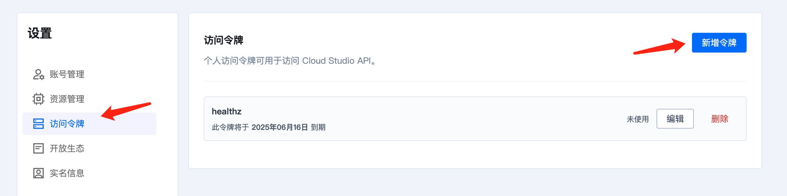

# nosleep - 防止 CloudStudio 空间休眠工具

## 原理

CloudStudio 空间在无活动时会自动休眠，导致长时间运行的任务中断。`nosleep` 通过以下机制保持空间活跃：

1. **读取配置信息**：从 `/var/run/cloudstudio/space.yaml` 读取空间配置（spacekey、region、host）
2. **构建健康检查 URL**：根据配置生成 `https://{spacekey}--api.{region}.{host}/healthz`
3. **定期心跳检测**：每 5 秒发送一次心跳请求，携带用户访问令牌（Authorization Bearer）
4. **并行执行任务**：心跳进程作为子进程在后台运行，主进程执行用户的命令
5. **自动清理**：命令执行完毕后，自动终止心跳进程并返回原命令的退出码

## 操作步骤

### 1. 获取访问令牌

直接访问访问令牌页面：https://cloudstudio.net/settings/tokens/new

或通过以下步骤：
1. 进入 CloudStudio 设置页面
2. 点击「[访问令牌](https://cloudstudio.net/settings/tokens/new)」
3. 点击「新增访问令牌」
4. 需勾选任意权限(空权限令牌不会生效)，然后直接创建并复制令牌
5. 保存令牌用于后续步骤



### 2. 配置环境变量

将获取的访问令牌设置为环境变量：

```bash
export CS_HEALTHZ_TOKEN=你的访问令牌
```

建议将此命令添加到 `~/.bashrc` 或 `~/.zshrc` 中，避免每次都需重新设置。

### 3. 使用 nosleep 执行任务

使用 `nosleep` 包装你的原始命令即可。

## 命令示例

### 前台任务执行

适用于需要实时查看输出且保持终端会话的场景：

```bash
# 执行长时间运行的命令
./nosleep python train.py

# 执行 sleep 测试
./nosleep sleep 1000
```

### 后台任务执行

适用于需要关闭浏览器后仍保持任务运行的场景：

```bash
# 基本后台任务
nohup ./nosleep python train.py &

# 带日志输出的后台任务（推荐）
nohup ./nosleep python train.py > task.log 2>&1 &

# 查看任务日志
tail -f task.log

# 查看后台任务
jobs -l

# 查看进程
ps aux | grep python
```

### 常见应用场景

```bash
# 深度学习模型训练
nohup ./nosleep python train.py --epochs 100 > training.log 2>&1 &

# 数据处理任务
nohup ./nosleep python process_data.py > process.log 2>&1 &

# 长时间的服务运行
nohup ./nosleep python server.py > server.log 2>&1 &

# 编译大型项目
nohup ./nosleep make -j8 > build.log 2>&1 &
```

## 注意事项

1. **访问令牌安全**：请妥善保管访问令牌，不要提交到代码仓库
2. **后台任务监控**：后台任务需要通过日志文件查看输出，使用 `tail -f` 实时监控
3. **任务终止**：如需终止后台任务，使用 `kill PID` 或 `kill %job_id`
4. **资源限制**：注意 CloudStudio 空间的资源限制，避免超出配额
5. **退出码保留**：`nosleep` 会返回原命令的退出码，便于脚本判断执行结果